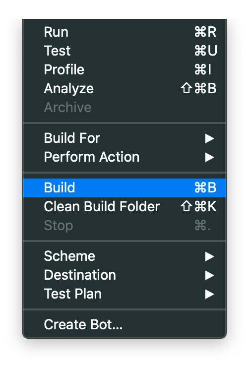

# X5GON-mobile

[](https://travis-ci.com/magetron/X5GON-mobile)

## Deployment Manual

### Prerequisites

* Git
* Xcode 11.3.1(macOS 15 Catalina+)
* iPhone running iOS 13.2+ or an iOS Simulator
* Cocoapods
* Homebrew (CLI-only)
* ios-sim (CLI-only)

### Installation

```zsh
$ git clone https://github.com/magetron/x5gon-mobile.git
$ pod install 
$ brew install ios-sim (cli-only)
```

#### To Use Xcode GUI:

**Build and Run**

Double click to open `x5gon-mobile.xcworkspace` and select build target on top left corner.

Click the `Run` Button to build and run.


**Build**

Click the `Build` Button for build only.




#### To use CLI

**Build First**

```zsh
$ source ./scripts/build.sh
```

**Then Run**

```zsh
$ source ./scripts/run.sh
```

**Note**: It is possible to run iOS application with temporary signature on an actual iPhone using CLI. However, given the complexity of steps, we do not recommend this deployment method at this stage.

### Documentation

**Build Docs**

```zsh
$ source ./scripts/build-docs.sh
```

Static Documentation will be generated at `./docs`. Simply double click `./docs/index.html` to open with a browser or use `open ./docs/index.html` on `macOS`.


## Showcase


