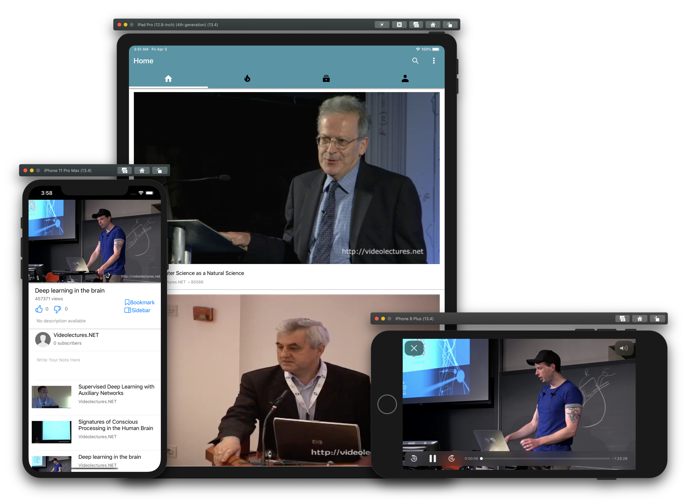

# X5GON-mobile [](https://travis-ci.com/magetron/X5GON-mobile)   


## Deployment Manual

### Prerequisites

* Git
* Xcode 11.3+(ideally **11.4**) running on macOS 14 Mojave+(ideally **15 Catalina**)
* Apple Device running iOS(iPadOS) 13.3+(ideally **13.4**) or an Device Simulator with similar specs
* Cocoapods
* Homebrew (**CLI-only**)
* ios-sim (**CLI-only**)
* ruby-gem (**docs-only**)
* swiftformat (**dev-only**)

### General Installation

```zsh
$ git clone https://github.com/magetron/x5gon-mobile.git
$ pod install 
$ brew install ios-sim (CLI-only)
$ gem install jazzy (docs-only)
$ brew install swiftformat (dev only)
```

#### To Use Xcode GUI:

**Build and Run**

Double click to open `x5gon-mobile.xcworkspace` and select build target on top left corner.

Click the `Run` Button to build and run.


#### To Use CLI

**Build First**

```zsh
$ source ./scripts/build.sh
```

**Then Run**

```zsh
$ source ./scripts/run.sh
```

**Note**: It is possible to run iOS application with temporary signature on an actual iPhone using CLI. However, given the complexity of steps, we do not recommend this deployment method. 

### Building, Testing 

#### To Use Xcode GUI:

Select relevant option / profile in the **Product** drop down menu of Xcode.


#### To Use CLI

**Build with Test**

```zsh
$ source ./scripts/build.sh -test
```

Alternatively, test with `Swift 5.1, Xcode 11.3` backwards compatible feature.

```zsh
$ source ./scripts/build.sh -old-test
```

### Documentation

Online version deployed [on GitHub Pages](https://patrickwu.uk/X5GON-mobile).

**Build Docs**

```zsh
$ source ./scripts/build-docs.sh
```

Static Documentation will be generated at `./docs`. Simply double click `./docs/index.html` to open with a browser or use `open ./docs/index.html` on `macOS`.

### Setting up new Development Environment

**Install Development Dependencies and Git Hooks**

```zsh
$ source ./scripts/setup-dev.sh
```

This script
* sets up a local `Git` pre-commit hook to run `git-diff` and `swiftformat` on source code.
* installs development required dependencies for local user.


## Showcase

### Interface




### Test Coverage


### CI/CD with Travis


