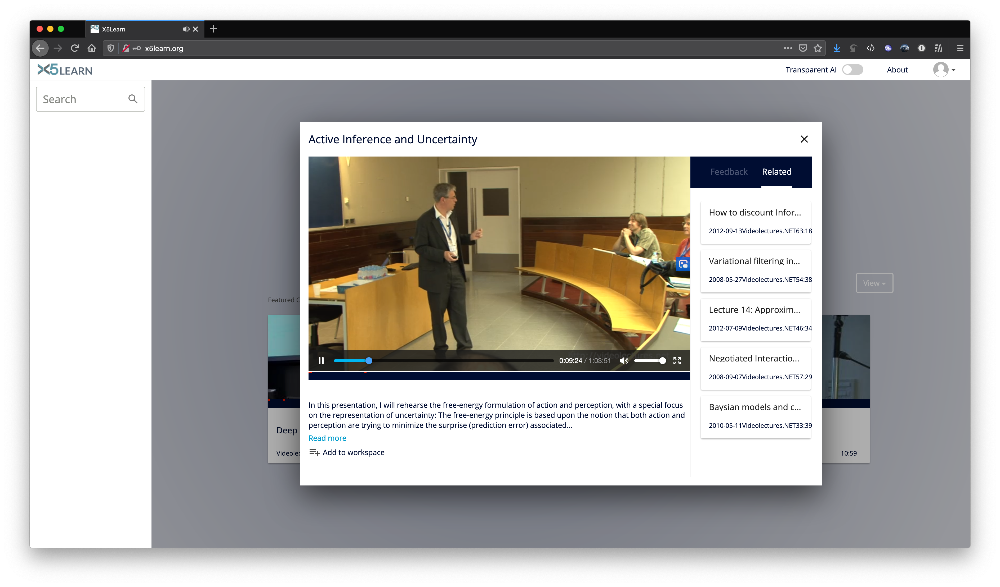
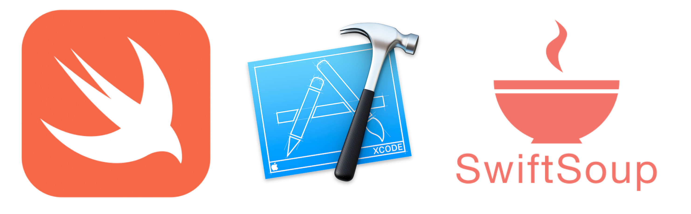
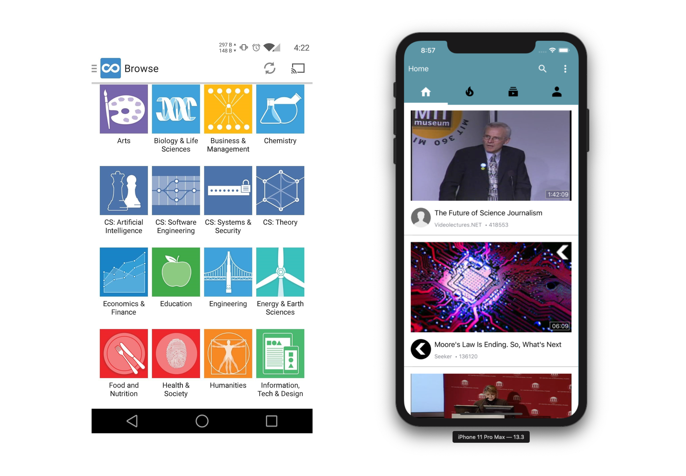

# An innovative approach to re-design mobile learning experience with X5Learn

Patrick Wu, Yinrui Hu

## About Us

Hello, we are Team 4. My name is [Patrick Wu](https://www.linkedin.com/in/patrick-daiqi-wu/), the team lead and a 2nd-Year Computer Science student at University College London. My interest mainly lies in low-level system design and networked systems. For this summer, I'm going to intern at a trading firm working on its infrastructural components.
My teammate [Yinrui(Felix) Hu](https://www.linkedin.com/in/yinrui-hu-050215182/), is also a second-year computer science student studying at UCL. He is mostly interested in artificial intelligence and cyber-security related fields.
I am delighted to be working with Yinrui this year, and developed a brand new mobile application with many innovative approaches for UCL's X5Learn research team, our industrial partner.

## What have we been working on?

Online Education is no stranger to us, students, nowadays, as we have been utilising this extensively in day to day life. For instance, due to the recent COVID-19 outbreak, UCL students would all logon to Moodle to conduct remote learning through contents of formats including but not limited to videos, texts and audios. Apart from Moodle, there are such a great number of alternatives out there, e.g. Coursera, Khan Academy, LinkedIn Learning, MIT Open Courseware and many more. The trouble mainly lies which platform to choose instead of a lack of learning materials. As a student, we have spent way too long looking for a useful resource rather than learning itself. Therefore, X5GON and X5Learn as a Software-as-a-Service (SaaS), can solve this problem for you.

The main focus of X5GON development team is creating a solution that will help users/students find what they need not just in OER repositories, but across all open educational resources on the web. This solution will adapt to the user's needs and learn how to make ongoing customised recommendations and suggestions through a truly interactive and impactful learning experience.

 

Figure 1. A demonstration of X5Learn's website version.

Our goal, as a student team, is to develop a mobile application that utilises the X5Learn platform and provide an authentic and mobile-friendly user experience. With this mobile application, the X5Learn system would be able to attract more customers from the mobile platform and enable users to access their customised X5Learn learning contents at all times.

## What are the technical challenges?

The critical challenge above all is to differentiate our application from other proprietary learning platforms. We continuously ask ourselves how to make the app more accessible and easy to navigate around for users. Given the fact there are many established applications out there, our team considered trying them out ourselves and conduct double-blind experiments on UI, app responsiveness and content relevancy experiments. We have learnt a lot in the process and greatly influenced our design of X5GON-Mobile afterwards.

Whilst we are testing out multiple applications under the `eduroam` network environment, there was one significant issue that emerged out of the dark. Some apps, under mediocre network environment, suffered from constant loss of network connection and plodding loading speed. Also, given the fact that the X5Learn usually takes 10 to 15 seconds to process videos and generate analytic reports, these together makes the app increasingly laggy and unusable at all under such circumstances. This issue of performance we noticed at an early stage influenced our application design and development process thereafter and is proven to be a significant differentiating factor for our application.

Last but not least, another essential technical challenge we faced was that the X5Learn was in ongoing development. Hence, many of the functionalities we aim to accomplish in our project are still in development or doesn't exist as an API from the back-end. This caused us considerable trouble initially. However, we were able to overcome this difficulty eventually and made our application more adaptable to this type of situation, which would be beneficial for future expansion of the whole platform after our delivery of the project.

## How did we solve them?

Figure 2. An overview of the technologies used in this project.

We tackled challenges above using advanced technology provided by `Apple`, the open-source community and algorithms written by ourselves. 

Figure 3. A comparison between traditional learning app and our approach.

From a design perspective, we took the information-feed approach rather than listing all courses available for the users find. As on most other platforms, users would have to search for what they want to learn, we actively push this information to the screen for users to choose from, similar to video sites but unlike a learning platform. Our design also utilises an innovative way of enabling users to read bullet-points or browse external supportive contents. Users can scroll to a sidebar whilst not stopping the video and start from there. They can also minimise the video to let it play as a floating window at the bottom of the screen. This design received great feedback from our clients and users at our testing stage.

 

Figure 4. A demonstration of our app's performance on videos.

With regards to the performance of the application, we utilised extensive caching and predicting techniques to minimise the lag and increase the responsiveness. First of all, the choice of using `Swift` to develop a native `iOS` application provides us with a faster foundation compared to hybrid frameworks like `React Native`. More so, our aggressive pre-loading daemon utilised a `HashMap` storing technique and regularly fetches first 20-seconds of content whenever user finds the thumbnail on display. Although we did make a trade-off of having more background tasks, which is negligible, app users now receive a notably faster application and smoother learning experience.

As a project that has both the ongoing development of front-end and back-end at the same time, we found it challenging to adapt to the constant changing API as an external mobile application. Therefore, we then utilised `SwiftSoup`, an external parser for HTML,
together with our own algorithm to analyse changing API endpoints on the fly and self-adapt the code. This still at an early stage and would require a constant change of code to actually make the new version work. However, this adaptive API layer has undoubtedly saved us a lot of time investigating broken APIs and migrating to new ones.

## Some Final Thoughts

Having never developed an `iOS` application, we have learned a lot about `Apple` 's tool-chain and especially the `Swift` language. While developing this project, an issue among which also encouraged to make an actual contribution to the `apple/swift` language on its co-routine implementation. Our team find this year of cooperating with UCL's X5Learn Team very enjoyable and worthwhile.

