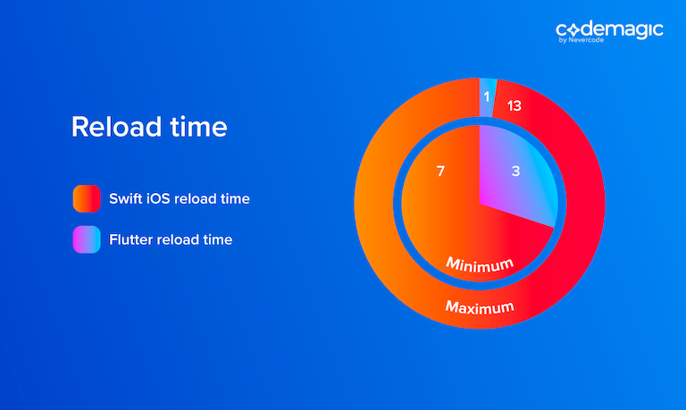
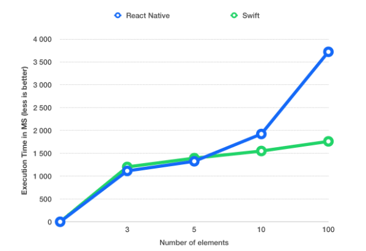

## Overview 

Since our main task is to develop an `iOS` application for `X5GON`, it is intuitive to think of the language `Swift` backed by `Apple` (Apple, 2020). Also, `React Native` (Facebook, 2020)  and `Flutter` (Google, 2020) are also viable choices given the recent trend of cross-platform development with `JavaScript` and `Dart`. As our client have a web-based application in development already, we would not be able to develop a Progressive Web App as per client's request. 

To pick a language or framework for further development, we need to compare them on multiple aspects including but not limited to language, tooling, framework stability, security, licensing and most importantly, performance.

Hence, this article aims to evaluate and analyse the benefits and drawbacks of using `Swift`, `React Native` and `Flutter`, before attempting to argue that `Swift` will be the most suitable and elegant choice for the project.

## Language

First and foremost, we need to pick a reliable language for our project. An optimal language choice would provide reliable code, eliminate unsafe usages and in the meantime, guarantees simplicity, expressiveness and performance. Therefore, we compare and evaluate `Swift` and `Javascript (ES6+)` in this section, and attempts to conclude that `Swift` is a more ideal language for our project.

### Background

To provide a background for the context, we will briefly introduce our candidate toolchains, starting with `Swift`. `Swift` is a general-purpose, compiled programming language developed by `Apple Inc.` for all its platforms starting 2014. It is built with the famous `LLVM` compiler framework and is seen as a successor for `Objective-C`, an `Apple`'s variant of `C/C++` language (Timmer, 2014). Compared to its predecessor, it supports many core concepts, e.g. dynamic dispatch (Milton and Schmidt, 1994), widespread late binding (Schrenier, 1994) and extensible programming (Gregory, 2004), in a much safer way. That is, in other words, `Swift` provides safe alternatives to these concepts while addressing common errors, notably null pointer dereferencing(Rose, 2017) and undefined callbacks (Apple, 2020).

`Javascript` on the other hand, has a much longer history. Starting in 1995, its first announced by NetScape and Sun. (PR Newswire, 1995) Over the years, although `JavaScript` has changed a lot, it remains a just-in-time compiled, multi-paradigm programming language that conforms to the spec of `ECMAScript` (IETF Tools, 2006). It has features including but not limited to dynamic typing, prototype-based object orientation, which is dynamic and flexible but might cause issues from time to time (Flanagan, 2011).

### Comparison 

Regarding the aspect of providing reliable and type-safe code, `Javascript` is less preferable than `Swift`, given its weakly dynamic type systems. For this reason, `Javascript` introduces a lot of representation mismatches and silent type conversions (Jensen et al., 2009), resulting in hard-to-track bugs, which is non-exist in `Swift`. Although unsafe `Swift` can be written dynamically, the safe `Swift` is a strong statically typed language with many modern safety mechanisms, including but not limited to forced wrapping, fallback variables, mutable/immutable definitions and the forbidden default value of `nil`. On that note, `Swift` does outweigh `Javascript` from a language safety perspective.

There are numerous similarities between both `JavaScript` and `Swift` from a syntax perspective, with a couple of examples here at [Folio](https://www.folio3.com/blog/swiftly-javascript-from-javascript-to-apples-swift/) (Folio, 2019). Our team has concluded although differences exist between `Javascript` and `Swift`, the essence remains the same. As compared to `JavaScript`, `Swift`, as mentioned earlier, provides a lot of advancements in syntax. Arguably, one might say it can be said that the more features a language provides, the harder it is to program with it. Since then you need to know most of the syntax to program effectively (Wirth, 2020). However, from the team's perspective, the lead programmer does come from a `C/C++` background, such that he believes the advancements and syntax sugar of `Swift` would be more helpful writing better software.

Given these reasons, our team picked `Swift` over `Javascript` from a programming language perspective.

## Tooling

Meanwhile, our team considers tooling convenience when choosing our tech stack. As for `Swift` and `iOS` development, its tooling `Xcode IDE` (Apple Developer, 2020) is backed by `Apple`. `React Native` or `Flutter`, in contrast, does have native support but relies on Command-Line-Interface (CLI) of `XcodeBuild` to build the application. However, with that said, one can use `Jetbrains WebStorm` (Jetbrains, 2020) or `VSCode` (Microsoft, 2020) at its convenience thanks to the flexibility `JavaScript` development provides.

### Comparison

From a development perspective, `Swift` is, first of all, a compiled language, while `JavaScript` is an interpreted language (although most engines currently do Just-in-Time(JIT) compilation instead (Auler et al., 2014) ). This is an advantage for `React Native` and `Flutter` as they support hot-reloading during development (Bigio, 2016). It is very efficient as you can see changes instantly in less than 1 second, compared to `Swift` where you have to re-build in about 7 to 8 seconds (CodeMagic, 2020), as you can see below in Figure 1. 

*Figure 1. A comparison between Swift and Flutter Reload Speed (CodeMagic, 2020)*

Also, compared to `Swift` as a relatively new language, `Javascript` as a whole does provide a much larger community and codebase. `JavaScript` has a broader approval, being mentioned in 5034 company stacks & 6258 developers stacks; compared to Swift, which is listed in 979 company stacks and 526 developer stacks. (Stackshare.io, 2020) Such that, when implementing a feature, `React Native` or `Flutter` would be easier as you can call an open-source library and utilise its features. 

With the reason mentioned above, our team favoured `React Native` or `Flutter` from a tooling perspective, but eventually didn't choose these as our tech stack given other reasons.

## Framework Stability

Another important factor our team took into consideration is the stability of a framework. As our client will be supporting and maintaining this application after our project finishes, we believe choosing a more stable and reliable platform in the long term will be beneficial.

### Comparison

As being backed by `Apple`, `Swift` and `Xcode` is guaranteed to work together as the official development tool for `iOS` (Apple, 2020). Since this is the native language for `Apple` mobile platforms, `Apple` develops all its applications and foundations with `Objective-C` and `Swift`. As `Swift` binds closely with these platforms, a bug on `Swift` would most likely a bug on all other frameworks. Regarding long term support, `Apple` is extremely unlikely to drop support for `Swift` on their platforms.

However, `Flutter` and `React Native` are on the contrary to stable. They are both relatively new frameworks in active development. As `Flutter` and `React Native` brings us with an entire software development platform, if `Google` or `Facebook` stop maintaining them, there would be a quick replacement. A disastrous example could be found in 2013 when `Facebook` shut down its backend development platform `Parser`. (Tepper, 2020) As the user agreement states, `Facebook` might drop support at any time as the organisation would wish given its a free-of-charge open sourced service. With that noted, similar closures might happen for non-official development platforms.

Thus, from a stability and long-term maintainable viewpoint, `Swift` does outperform `React Native` and `Flutter`.

## Security and Licensing

Although sometimes not taken into serious consideration, our team does take security and licensing of software modules into consideration. We emphasize on delivering secured and proprietary software to our clients. 

### Comparison

The language `Swift`, although backed by `Apple`, is under the commonly used `Apache License 2.0`. There is no proprietary or paid parts of `Swift` language. Regarding `Xcode`, although it is proprietary software, we are legally allowed to develop closed-source and commercial applications with it on `Apple` platforms (Apple, 2019). In most mobile application developed with `Swift`, it is possible to avoid external packages, either to use `Apple's` own template animations or write it on your own.

Opposing to `Swift`, it is almost impossible to write an application with `React Native` or `Flutter` without importing other `yarn` or `npm` open source modules, as these frameworks rely heavily on these. These modules might work just fine at the development stage but might cause issues as these open source modules might contain malicious code. For instance, `left-pad` an incredibly simple library that simply adds chars to the beginning of strings that's gone wrong made the `React` as a whole stopped updating (Collins, 2016). These clearly illustrate the possibility of obfuscated malicious injection of `JavaScript` into libraries that depends on each other.

Another significant issue is licensing. When importing so many modules, it would be difficult to check the license of all of them. If any modules are imported with GPL license and we use it as part of our proprietary software, we would also have to open source, as the license requires. (Free Software Foundation, 2020) With `Swift`, the dependency trees are shallower and we can therefore check all the licenses before deploying our application.

To avoid all these issues and security risks, our team preferred `Swift` and `Xcode` over `React Native` or `Flutter` as our development tool.

## Performance

Last but not least, our task does include building a performant and responsive application with rather a high load on the background. This load includes but not limited to video buffering and preloading, thumbnail generation and fetching recommendation and user notes. This does impose a certain amount of burden and our goal is to minimize its effect felt by our users. In the experiment below, we compare `Swift` and `React Native` and assumed that `Flutter` will perform quite similar to `React Native`.

### Comparison

With reference to Bilberg (2018), who made a thorough investigation of performance between `Swift` and `React Native` through creating a similar app using both tech stacks and compare the time difference, we show the Figure below to better address the issue.

*Figure 2. A comparison between `Swift` and `React` on loading different number of graphical elements (Bilberg, 2018)*

As clearly shown in Figure 2 above, `React Native` proved to perform in some instances better when compared to `Swift`. When rendering only 3 graphical elements, `React Native` performed 7.7% better. When that number was 5, `React Native` still performed better, a winner of 5.2% when compared to the performance of the `Swift` project. However, extending the elements to 10 is where we first noticed a severe difference in performance between the two artefacts, as we can observe a performance difference at 24% to the favour of the Swift project. The last test which served 100 elements to the artefacts proved to be the biggest difference between the two, showing a whopping difference with 114% in performance difference in the favour of the Swift project. (Bilberg, 2018)

As we consider our program rather heavyweight on calculation and fetching, we favoured `Swift` over `React Native` or `Flutter` in our tech stack.

## Summary

In conclusion, with the advantages of a modern and safe language, a more stable framework, a more secure and license development environment and better performance, and at the slight cost of worse tooling, our team concluded that `Swift` would be a better fit for our project, and thus proceeded with the development of a native mobile application.

## References

Apple (2020). Swift - Apple Developer. [online] Available at: https://developer.apple.com/swift/ [Accessed 22 Jan. 2020].

Apple (2019). Xcode and Apple SDKs Agreement. Aug 7, 2019. EA1647. Available at: https://www.apple.com/legal/sla/docs/xcode.pdf [Accessed 21 Jan. 2020].

Apple Developer. (Jan 2020). "Closures". Swift 5.1. Retrieved Jan 15, 2020.

Apple Developer. (2020). Xcode - Apple Developer. [online] Available at: https://developer.apple.com/xcode/ [Accessed 21 Jan. 2020].

Auler R., Borin E., de Halleux P., Moskal M., Tillmann N. (2014) Addressing JavaScript JIT Engines Performance Quirks: A Crowdsourced Adaptive Compiler. In: Cohen A. (eds) Compiler Construction. CC 2014. Lecture Notes in Computer Science, vol 8409. Springer, Berlin, Heidelberg

Bigio, M. (2020). Introducing Hot Reloading · React Native. [online] Facebook.github.io. Available at: https://facebook.github.io/react-native/blog/2016/03/24/introducing-hot-reloading.html [Accessed 21 Jan. 2020].

Bilberg, D. (2018). Comparing performance between react native and natively developed smartphone applications in swift: A comparative analysis and evaluation of the React Native framework (Dissertation). Retrieved from http://urn.kb.se/resolve?urn=urn:nbn:se:his:diva-15480

CodeMagic. (2020). Swift vs Flutter - A side by side comparison for iOS development. [online] Available at: https://blog.codemagic.io/flutter-vs-swift/ [Accessed 21 Jan. 2020].

Facebook (2020). React Native - A framework for building native apps using React. [online] Available at: https://facebook.github.io/react-native/ [Accessed 22 Jan. 2020]

Flanagan, David. (2011). JavaScript - The Definitive Guide ep. 6. Sebastopol: O'Reilly Media.

Folio (2019). Swiftly JavaScript - From JavaScript to Apple’s Swift - folio3. [online] Available at: https://www.folio3.com/blog/swiftly-javascript-from-javascript-to-apples-swift/ [Accessed 21 Jan. 2020].

Free Software Foundation (2020). The GNU General Public License v3.0- GNU Project - Free Software Foundation. [online] Available at: https://www.gnu.org/licenses/gpl-3.0.en.html [Accessed 22 Jan. 2020].

Google (2020). Flutter - Beautiful native apps in record time. [online] Available at: https://flutter.dev [Accessed 22 Jan. 2020].

Gregory V. Wilson (Dec/Jan 2004–2005). "Extensible Programming for the 21st Century". ACM Queue 2 no. 9.

IETF Tools. (2006)."RFC 4329". Archived from the original on 2019-05-27. Retrieved 27 May 2019.

Jensen S.H., Møller A., Thiemann P. (2009) Type Analysis for JavaScript. In: Palsberg J., Su Z. (eds) Static Analysis. SAS 2009. Lecture Notes in Computer Science, vol 5673. Springer, Berlin, Heidelberg

Keith, Collins. (2016). How one programmer broke the internet by deleting a tiny piece of code. [online] Quartz. Available at: https://qz.com/646467/how-one-programmer-broke-the-internet-by-deleting-a-tiny-piece-of-code/ [Accessed 21 Jan. 2020

Milton, Scott; Schmidt, Heinz W. (1994). Dynamic Dispatch in Object-Oriented Languages (Technical report). TR-CS-94-02. Australian National University. CiteSeerX 10.1.1.33.4292.

PPR Newswire (Dec 4, 1995). Press release announcing JavaScript, "Netscape and Sun announce JavaScript".

Rose, Jordan (Sep 5, 2017). "Make unsafe pointer nullability explicit using Optional". Swift 3. Retrieved Dec 5, 2019.

Schreiner, Axel-Tobias (1994). Object-Oriented Programming With ANSI-C (PDF). Munich: Hanser. p. 15. ISBN 3-446-17426-5.

StackShare. (2020). JavaScript vs Swift | What are the differences?. [online] Available at: https://stackshare.io/stackups/javascript-vs-swift [Accessed 21 Jan. 2020].

Tepper, F. (2020). Facebook’s Parse developer platform is shutting down today. [online] Techcrunch.com. Available at: https://techcrunch.com/2017/01/30/facebooks-parse-developer-platform-is-shutting-down-today/ [Accessed 21 Jan. 2020].

Timmer, John (June 5, 2014). "A fast look at Swift, Apple's new programming language". Ars Technica. Condé Nast. Retrieved Jan 12, 2020.

Wirth, M. (2016). The cognitive load of programming languages on the novice programmer. [online] The Craft of Coding. Available at: https://craftofcoding.wordpress.com/2016/09/14/the-cognitive-load-of-programming-languages-on-the-novice-programmer/ [Accessed 21 Jan. 2020].
